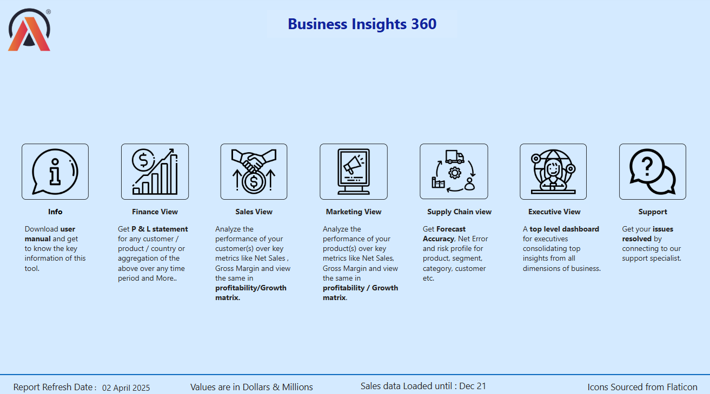
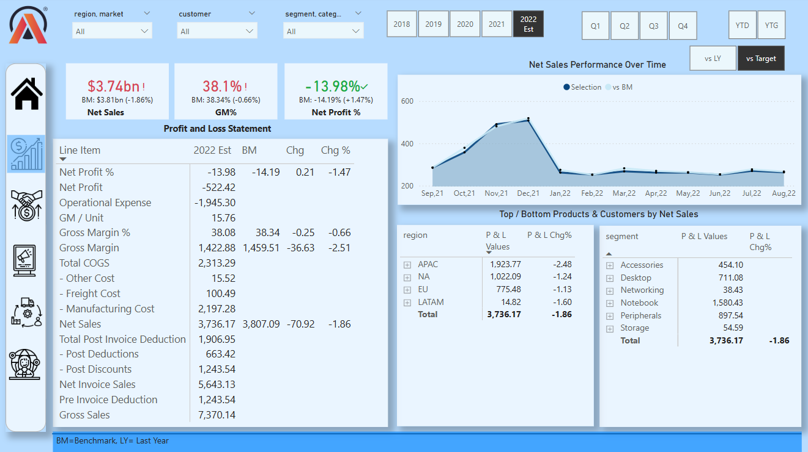
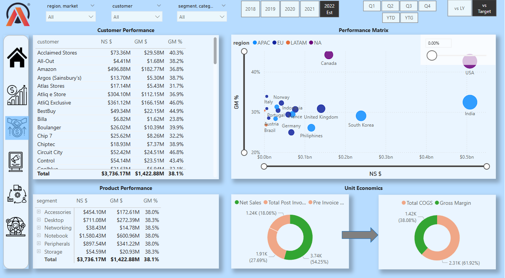
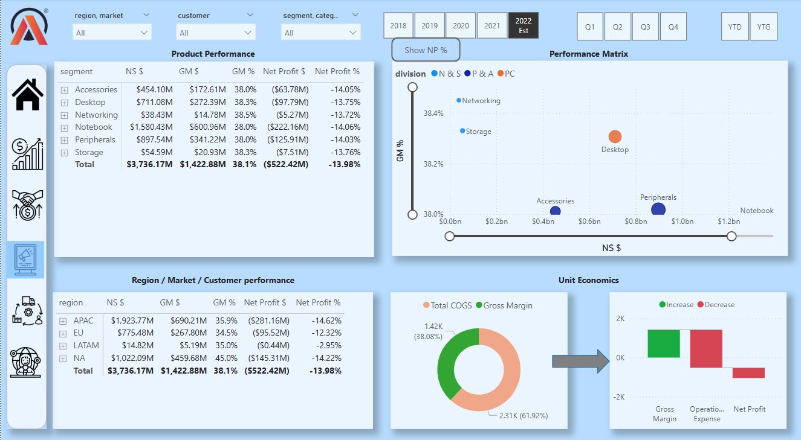
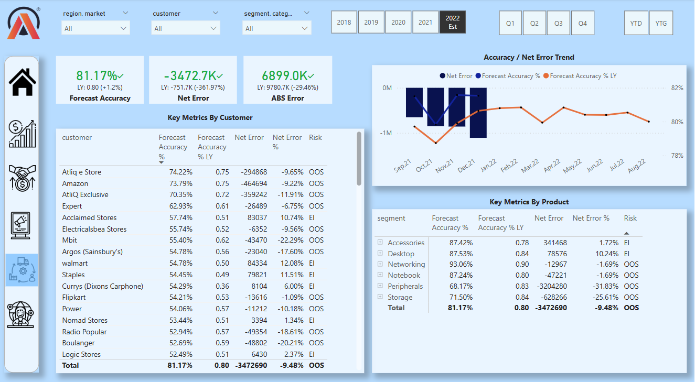
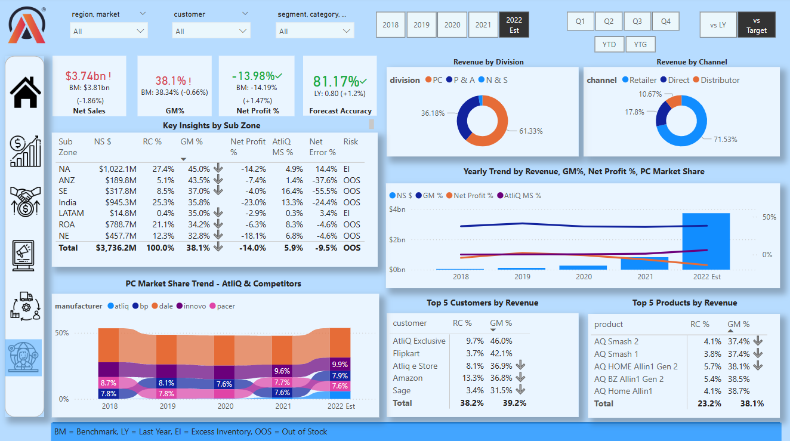

# Global Business Insights 360 – Power BI Project

This is a real-world, project-based simulation developed during a data analytics course for an imaginary electronics company, AtliQ Hardware.

## Problem Statement

AtliQ Hardware is a consumer electronics company with operations in multiple countries. Despite rapid business growth, the company relied heavily on Excel files for data analysis, making it difficult to generate timely and actionable insights.

Due to the lack of effective analytics, AtliQ Hardware suffered a major loss in the Latin America region. To address this, senior executives decided to invest in a data analytics project and formed a dedicated team to build interactive dashboards and enable real-time decision-making across departments.

## Dashboards Built

- Home Dashboard – High-level KPIs for leadership
- Finance Dashboard – Revenue, Gross Margin, Profit & Loss
- Sales Dashboard – Product and customer performance
- Marketing Dashboard – Regional performance and unit economics
- Supply Chain Dashboard – Forecast accuracy and industry trends
- Executive Dashboard – Top products, top customers, market share

## Technical Highlights

- Data Cleaning & Transformation – Using Power Query
- Data Modeling – Snowflake and Star Schema
- KPI Design – Built with DAX measures
- Interactive Navigation – Bookmarks, page navigation & toggle buttons
- Dynamic Visualization – Tooltips, slicers & conditional formatting
- Performance Tuning – Using DAX Studio

## Key Learnings

- Best practices in data modeling and DAX calculations
- Building interactive and user-friendly Power BI reports
- Enhancing user experience with advanced features
- Applying business context to analytics for better decisions

## Dashboard Screenshots

| Dashboard        | Screenshot |
|------------------|------------|
| Home             |  |
| Finance          |  |
| Sales            |  |
| Marketing        |  |
| Supply Chain     |  |
| Executive        |  |

Note: The PBIX file is not included due to size and privacy reasons. Please refer to the screenshots above for insights.
